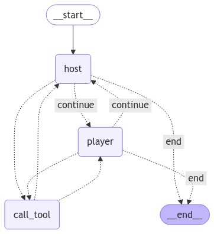

# Self-Play LLM for 20 Questions Game
## Tech Stack
- Langgraph: State Graph for LLM Agents
- LLM: OpenAI


## Agent Architecture



## Quick Start
1. Create virtual environment and install the dependencies
```
pip install -r requirements.txt
```

2. Create an OpenAI key and put it in the `.env` file
```
OPENAI_API_KEY = sk-...
```
3. Run the code using `python agent.py`